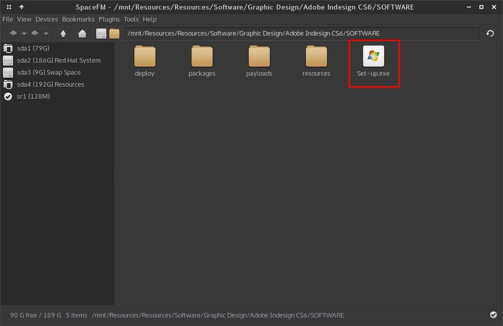
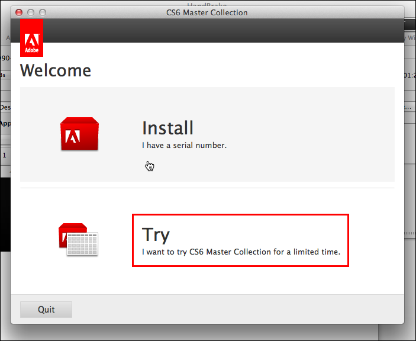
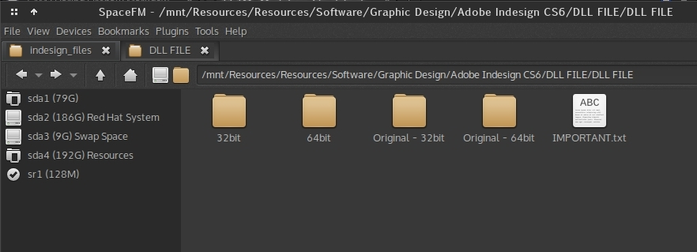

# Installation Instructions for Adobe Indesign/Photoshop CS6

 Since we are using a cracked version of Indesign and Photoshop, during installation **there must be no internet connection**.

 > Do not install Photoshop and Indesign at the same time. First install either of these and then the other. This guide is for both Photoshop and Indesign.

 > For those of you using Photoshop/Indesign CC version, the steps are similar.

### Installation

 - First step is to start the installation.

   

   I currently do not have Windows, so I cannot post screenshots of actual installation. But the installation process is straight-forward.

   Since you have already disconnected the internet, run the Set-up.exe file as shown above.

 - Soon you will see this window. Click on the "Try" option (marked with a red rectangle).

  

  After this step, there is nothing else to do except clicking next, next and so on. **DO NOT** touch any other options, just let them be.

  After the installation completes, close the installer. **DO NOT** connect to the internet.

 - Open the app (Indesign or Photoshop) once, and then close it. This is important, you have to run  the app once in trial mode.

### Cracking
 - Now comes the fun (cracking) part. This is somewhat peculiar step so watch closely. (I think this is the thing that was bugging you for days).

 - Open the folder where the cracked DLL files are (must be named either 'Cracked DLL' or 'DLL FILES')

   

 - Ignore the folders named Original-32bit and Original-64bit for now. That file marked IMPORTANT.txt is also not so important.

 - The two folders 32-bit and 64-bit each have a file known as **amtlib.dll**.

 - Most of you are using 64-bit Windows. Open the C: drive. (If you use a 32-bit version of Windows, you only have to care about the 32-bit folder).

 - There are two folders - "Program Files" and "Program Files (x86)".

  - "Program Files" store 64-bit software, each and every file in this folder is for 64-bit systems.

  - "Program Files (x86)" store 32-bit software files.

 #### For Indesign CS6

    - Now, the amtlib.dll from "32-bit" folder must go into the folder C:\Program Files (x86)\Adobe\Adobe InDesign CS6.

    - And, the amtlib.dll file from "64-bit" folder must go into C:\Program Files\Adobe\Adobe Media Encoder CS6

    - Windows will ask you to overwrite, just do it.  

 #### For Photoshop CS6

    - Be Careful, **DO NOT** copy amtlib.dll from Indesign folder, use the one provided by Photoshop.

    - The Photoshop installation folder has similar "32-bit" and "64-bit" folders in "Cracked DLL" folder.

    - Copy 64-bit amtlib.dll into C:\Program Files\Adobe\Adobe Photoshop CS6

    - Copy 32-bit amtlib.dll into C:\Program Files (x86)\Adobe\Adobe Photoshop CS6

    - There is an extra step for Photoshop, there is a folder known as Official_Update_Patch which contains AdobePatchInstaller.exe. After the cracking step, just run it. (This will simply update Photoshop).

 - Now you can connect to the Internet. Start Photoshop / Indesign.

 - This is not a fool-proof method, someday Adobe might discover that you are using cracked software and so the software may pop-up an error message.

 - However, it will work flawlessly in the University, because it cannot connect through proxy.

If you have any furthur problem regarding installation, just ask away on the WhatsApp group.
